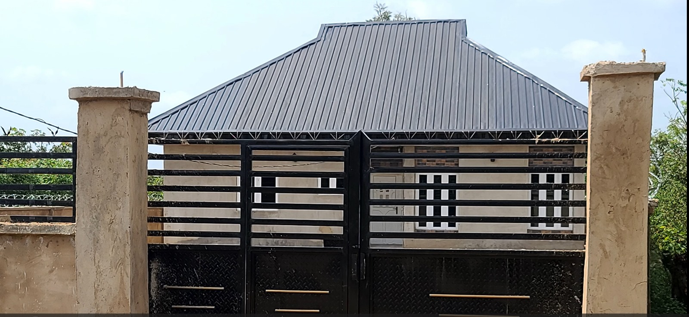

# Building-Comfort

## Introduction

A PhD research architect provided me with data obtained from the field for analysis.
The research was on "Daylighting and Visual Comfort in Residential Buildings in Lagos State, Nigeria".
The data with 142 columns and 1,169 rows could not be used in its raw form.

## Data Cleaning and Transformation
One of my first tasks was to understand the headings and transform them into Tableau readable form.
Then clean the contents from blanks, duplicates, spaces, and non-printing characters.

## Visualisations
In view of the fact that it is a research work, I got permission to use few visualisations of the work

### Building Form

Type of building goes a long way for daylighting and visual comfort in the building.

### Building Internal Shading

Any shading externally and internally affects daylighting and visual comfort of a building.

### Building Occupant Advice

Architects should be able to have more insights into building designs from advice from occupants of various buildings.

## Conclusion
I present this work as a sample of my data analysis experience and not to discuss the findings of the researcher.

#### _Disclaimer_
_The house used above has nothing to do with the research._

